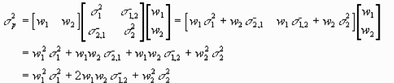

## Description
The given backtesting environment allows you to access past performance of your portfolio for a defined time range.
 
As an input, a user has to provide the list of tickers for a portfolio, define time range of backtesting, rebalancing period and a principle of rebalancing. Provided these inputs, the user will get an output with his/her daily returns, cumulative return and a chart with PnL dynamics in time. 
There are currently three basic rebalancing techniques: Volume weighting, Mean-variance and inverse volatility weighting.

## Rebelancing engines
An option **“Volume weighting”** allows you to rebalance your portfolio according to the trading volume of a defined range of stocks during a rebalancing period.
 
**“Mean-variance”** is a standard algorithm. According to a modern portfolio theory, higher portfolio risk is associated with a higher probability of high returns, and a lower risk is associated with a higher probability of lower returns. Markowitz suggests that investors are not prone to risk, which means that if there are two portfolios with the same expected return, investors will prefer the less risky. Thus, the investor will assume increased risk only if compensated by higher expected returns.

When using sharpe coefficient, we are interested in how much risk the portfolio takes, it pays off with its profitability. Thus, we choose the portfolio with the highest ratio

r_p = portfolio return 
r_f  = risk-free rate

σ_p = standard deviation of the chosen portfolio

On the other hand, **minimal volatility** portfolio is chosen, based on minimum overall variance and constitutes the least risk asset. The process of defining the best weights is the same as with mean-variance portfolio, however, the weights are chosen according to the least volatility, which is calculated as follows:

